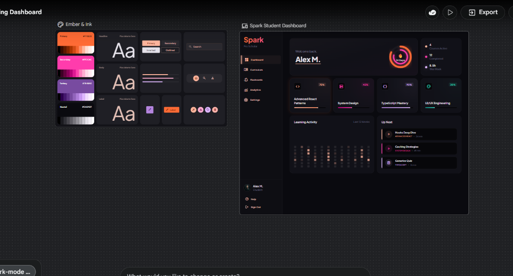

# Spark - Student Learning Dashboard

This project is a high-fidelity, interactive student learning dashboard prototype. The initial UI wireframes and visual design system were developed using Stitch, and then converted into a functional Next.js production build.



## Design Implementation
The visual design system ("Ember & Ink") relies on a dark-mode theme utilizing warm orange (#FF6B35) highlights, rounded borders, and flat card components. Stitch design tokens for spacing, color palettes, and typography were mapped directly to Tailwind CSS variables.

## Architecture

### Server / Client Component Split

| Component | Type | Description / Reason |
|---|---|---|
| `app/page.tsx` | Server Component | Fetches course data securely from Supabase on the server side |
| `app/loading.tsx` | Server Component | Handles page-level loading state skeleton fallback |
| `components/BentoGrid.tsx` | Client Component | Uses Framer Motion for entrance animations |
| `components/Sidebar.tsx` | Client Component | Manages sidebar toggle state and collapses responsively |
| `components/CourseCard.tsx` | Client Component | Handles progress bar load animations and hover events |
| `components/HeroTile.tsx` | Client Component | Renders the student dashboard welcoming and streak visualizers |
| `components/ActivityTile.tsx` | Client Component | Renders the weekly study activity chart and heatmap grid |
| `components/MobileHeader.tsx` | Client Component | Handles mobile top bar header and bottom navigation routing |

### Data Flow
1. Next.js Server Page fetches active courses from the Supabase client.
2. The page renders the BentoGrid component, injecting data as React props.
3. If the database connection fails, the dashboard catches the exception and falls back to mock course entries while displaying a warning notice.

### Supabase Table Schema
```sql
create table public.courses (
  id uuid default gen_random_uuid() primary key,
  title text not null,
  progress integer not null default 0,
  icon_name text not null default 'BookOpen',
  created_at timestamp with time zone default timezone('utc'::text, now()) not null,
  constraint progress_range check (progress >= 0 and progress <= 100)
);

alter table public.courses enable row level security;

create policy "Allow public read access" 
on public.courses 
for select 
using (true);

insert into public.courses (title, progress, icon_name)
values 
  ('Advanced React Patterns', 75, 'Code2'),
  ('System Design Fundamentals', 45, 'Server'),
  ('TypeScript Mastery', 90, 'FileCode'),
  ('UI/UX Engineering', 30, 'Palette');
```

## Animations
All transition states are optimized to prevent layout repaints and Cumulative Layout Shift (CLS):
- Entrance: Bento cards translate slightly on the Y-axis and fade in sequentially on load.
- Hover states: Elevates cards by scaling (1.5% scale increase) using spring animations.
- Glow transitions: Smoothly toggles border hover state using CSS opacity transitions to maintain layout stability.
- Highlight tracker: Snaps navigation background highlights into position using Framer Motion layoutId when switching tabs.

## Setup Instructions

1. Install dependencies:
```bash
npm install
```

2. Setup environment variables:
Create a `.env.local` file at the root:
```env
NEXT_PUBLIC_SUPABASE_URL=your_supabase_url
NEXT_PUBLIC_SUPABASE_ANON_KEY=your_supabase_anon_key
```

3. Run the development server:
```bash
npm run dev
```
